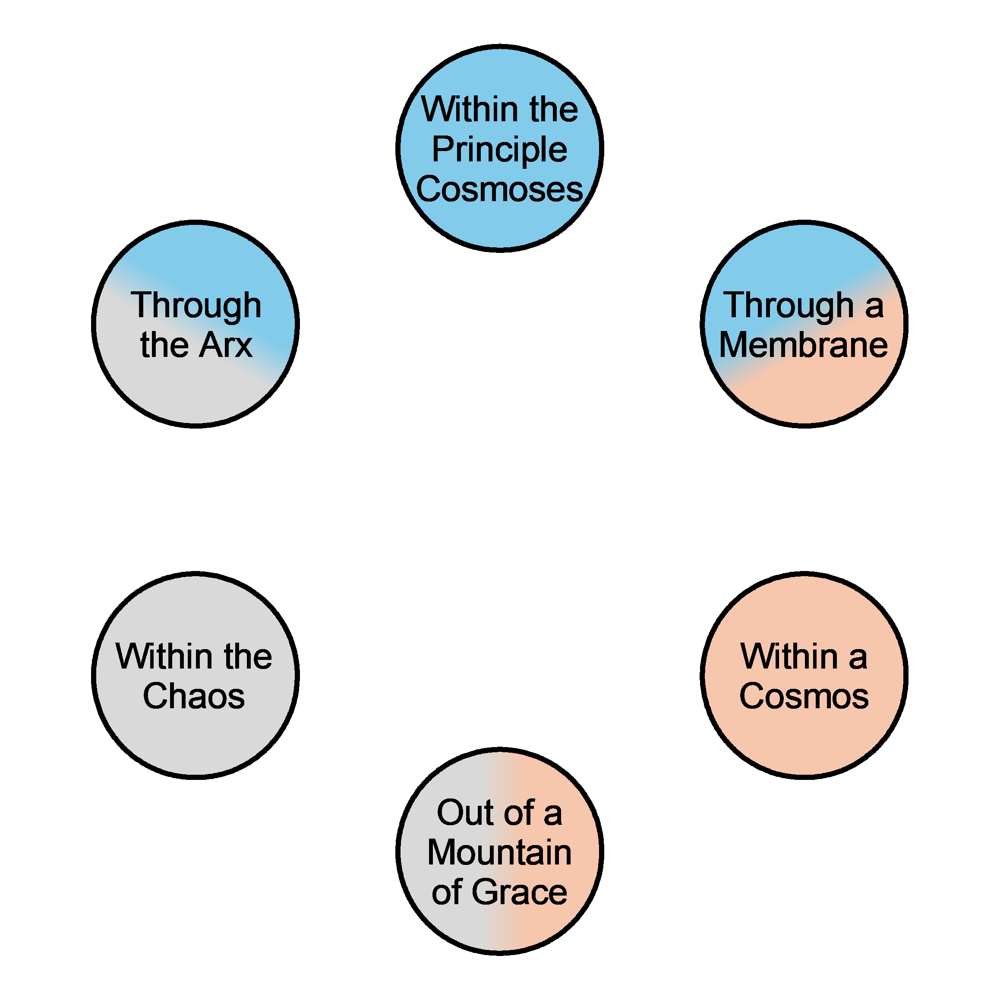

# The Flow of Grace

## Data-sheet

| Data Type | Rules |
| --- | --- |
| Rule Applies to | [[grace]] throughout the Principle and General cosmoses. |

## Behavior

[[grace]] is never created nor destroyed. Only moved and reshaped. Mostly, it acts like a gas, filling the space it's within. The cycle is as follows.

- Within the principle [[cosmos]]es (Except for [[The chaos (Principle Cosmos)|The chaos]])
  - Saturated with grace
  - grace is generalized
  - When grace is used/cast here, it goes straight through [[the Arx]] and back again.
- Though a [[Membrane (grace)|Membrane]]
  - grace gets specialized
  - Doesn't stop grace from entering, just changes how it behaves.
- Within a [[cosmos]].
  - grace is specialized.
  - Only When used/cast does it move on.
- Out one of the [[Mountains of Grace]]
  - grace starts to become generalized
- Within the Chaos
  - grace continues generalizing.
  - It becomes very unpredictable, hence the abilities of [[Oracle Soul]]s
- Through [[the Arx]]
  - grace becomes fully Generalized
- Re-entering the principle [[cosmos]]es the cycle repeats

Here is a diagram:

